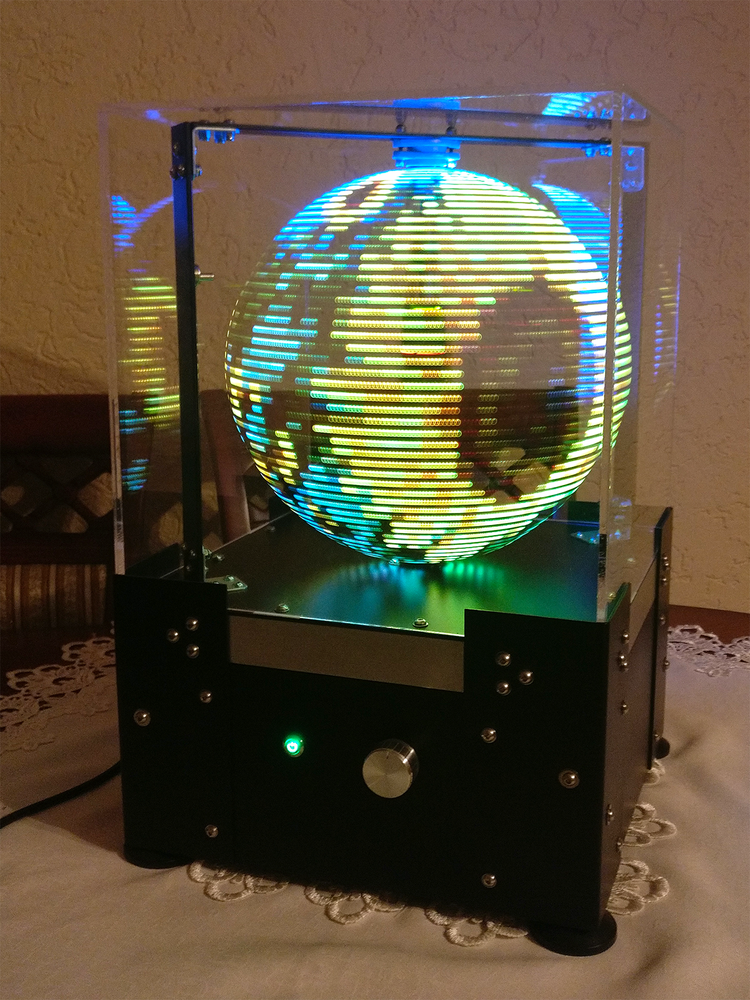
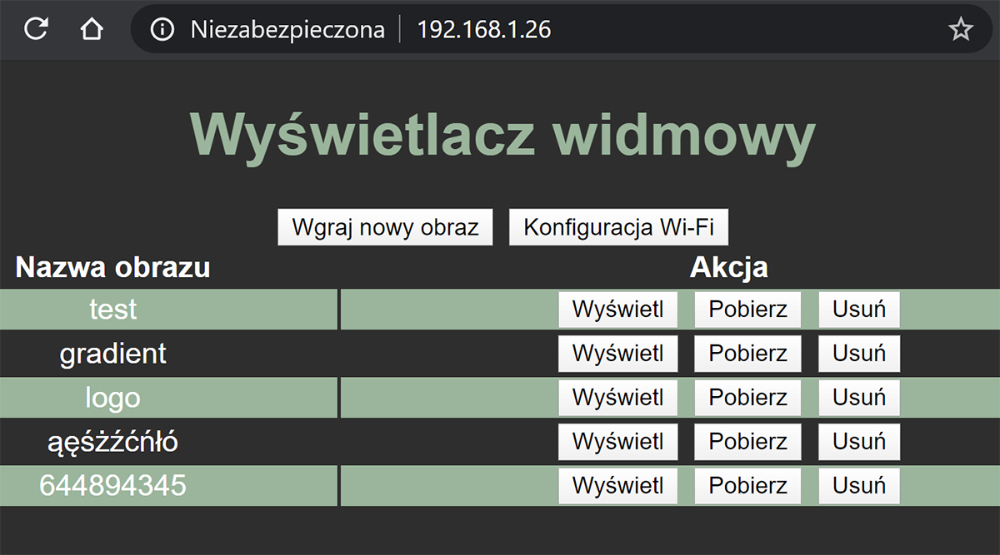

# POV display - wyświetlacz widmowy

Wyświetlacz widmowy wykorzystuje zjawisko bezwładności wzroku do wyświetlania obrazu o rozdzielczości większej, niż wynikałoby to z fizycznej liczby pikseli. W konstrukcji wykorzystana została adresowalna taśma LED RGB APA102C o długości 50 diod LED i zagęszczeniu 144LED/m. Rozdzielczość prezentowanego obrazu wynosi 200x50px

## Wideo:
https://www.youtube.com/watch?v=kHmsrFy9cqA

## Cechy:
* obsługa wyświetlacza za pośrednictwem panelu sterowania po nawiązaniu połączenia bezpośrednio z punktem dostępowym lub przez podłączenie urządzenia do sieci lokalnej
* panel sterowania umożliwia wyświetlanie, pobieranie oraz usuwanie dostępnych obrazów z karty pamięci, a także bezprzewodowe wgrywanie nowych
* obrazy podczas wgrywania poddawane są korekcji gamma oraz dopasowywana jest ich jasności i kontrast
* możliwość regulacji prędkości obrotowej w celu uzyskania porządnego efektu, synchronizacja wyświetlanego obrazu z nową prędkością następuje automatycznie
* zasilanie bezpiecznym napięciem 24V z zabezpieczeniem przeciążeniowym oraz ochroną przed odwrotną polaryzacją
* regulowane stopki umożliwiają poprawne wypoziomowanie konstrukcji
---
## Sterownik obrazu w formie nakładki połączonej z płytką ESP32:
* przetwornica obniżająca napięcie z 24V na 5V do zasilania logiki oraz taśmy LED
* szybki odczyt/zapis karty uSD przy użyciu 4 linii danych
* konwersja poziomów logicznych z 3.3V na 5V wykorzystując bramkę logiczną z wejściami w standardzie TTL, zapewniającą czas propagacji sygnału na poziomie 7ns
* obsługa czujnika halla służącego do synchronizacji wyświetlania kolejnych linii
* łączność Wi-Fi
* dwurdzeniowy procesor o taktowaniu 240MHz umożliwiający równoczesną obsługę obrazu oraz funkcji sieciowych
* współpraca kontrolera DMA ze sprzętowym SPI, pozwalająca osiągnąć częstotliwość odświeżania taśmy LED na poziomie 40Mhz

---

## Sterownik silnika:
* kontrola prędkości obrotowej silnika
* ograniczenie zakresu nastaw potencjometru poprzez mapowanie wartości, uniemożliwiając przekroczenie bezpiecznych prędkości
* monitorowanie stanu pokrywy zabezpieczającej
* informowanie o stanie pracy napędu
* sterowanie bramki tranzystora MOSFET napięciem 12V w celu obniżenia rezystancji otwartego kanału

